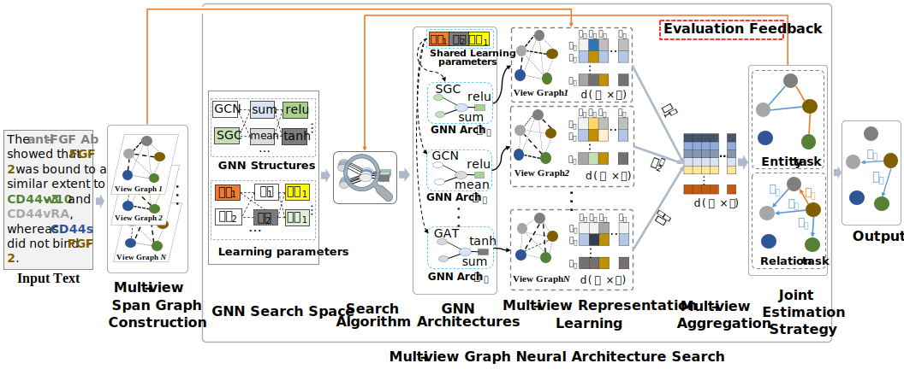

# MVGNAS

- MVGNAS is an automatic multi-view graph neural architecture search modeling framework for biomedical entity and relation extraction tasks.

- The framework of MVGNAS is as follows:

<br>
<div align=left>  </div>

<!-- ##  Instructions
The code has been tested with Python 3. To install the dependencies, please run:
```
pip install -r requirements.txt
``` -->
## Installing For Ubuntu 16.04

- **Ensure you have installed CUDA 10.2 before installing other packages**

**1. Nvidia and CUDA 10.2:**

```python
[Nvidia Driver] 
https://www.nvidia.cn/Download/index.aspx?lang=cn

[CUDA 10.2 Download and Install Command] 
#Download:
wget https://developer.download.nvidia.com/compute/cuda/10.2/Prod/local_installers/cuda_10.2.89_440.33.01_linux.run
#Install:
sudo sh cuda_10.2.89_440.33.01_linux.run

```

**2. Python environment:** recommending using Conda package manager to install

```python
conda create -n mvgnas python=3.7
source activate mvgnas
```

**3. Pytorch 1.8.1:** execute the following command in your conda env mvgnas

```python
pip install torch==1.8.1+cu102 torchvision==0.9.1+cu102 torchaudio==0.8.1 -f https://download.pytorch.org/whl/torch_stable.html
```

**4. Pytorch Geometric 2.0.2:** execute the following command in your conda env mvgnas
```python
pip install torch-scatter==2.0.9 torch-sparse==0.6.12 torch-cluster==1.5.9 torch-spline-conv==1.2.1 torch-geometric==2.0.2 -f https://data.pyg.org/whl/torch-1.8.0+cu102.html
```
**5. transformers:** execute the following command in your conda env mvgnas
```python
pip install transformers
```

**6. pyhocon:** execute the following command in your conda env mvgnas
```python
pip install pyhocon
```

**7. networkx:** execute the following command in your conda env mvgnas
```python
pip install networkx
```


## Running the Experiment
For training, please refer to the script 'main.py' 
```python
python main.py --dataset ade
```

Note: more details will be added soon.
